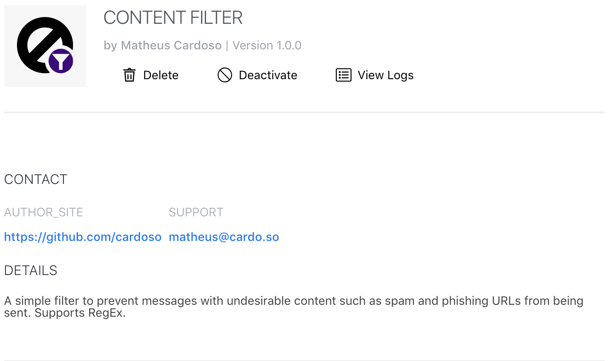

# Rocket.Chat.ContentFilter
⛔️ Content Filter App for Rocket.Chat - keep scammers and undesirable content out of your server

## Usage
### Regular Expressions
This app uses a list of regular expressions to block content sent from users, the searching is done not only in the message's text but also in attachment titles, fields, aliases and anything else that can be displayed as text or link.

You can define the list of regular expressions in the App's settings.

### Result

## Planned features
See the [issues list](https://github.com/cardoso/Rocket.Chat.ContentFilter/issues)
